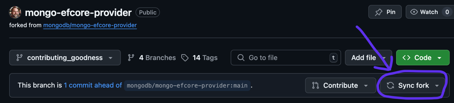
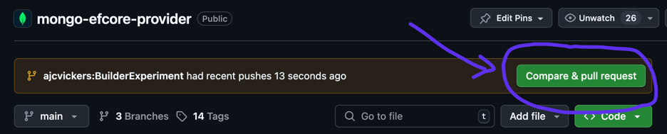

# Contributing to the MongoDB EF Core Provider

## Overview

This repo contains the code and tests for the official MongoDB database provider for [EF Core](https://github.com/dotnet/efcore).

## Find or create a tracking issue

Any bug fix should have an issue tracking it in the [Jira issue tracker for the MongoDB provider](https://jira.mongodb.org/projects/EF/issues/). First, check for any existing issue, and if found, make sure to read any discussion and look at any existing pull requests. If there is no existing issue covering your case, then create one and wait for feedback from the team for any guidance. This avoids you doing work that might not be accepted.

> Note: An issue is not required for a simple typo PR.

## Building and testing the code

It is important to ensure that any change works correctly and does not regress existing behaviors before submitting a pull request. To do this, you will need to build the code and run the tests on your local machine. This is straightforward, but does require some one-time set up.

### Install the .NET SDKs

The MongoDB database provider currently supports .NET 8 (LTS) and .NET 9. Install both SDKs from [Microsoft .NET home](https://dotnet.microsoft.com/download).

### Install git

Ensure that git is installed on your system. It may already be installed as part of your IDE or other development tools, such as [Homebrew](https://brew.sh/) on MacOS. Alternately, it can be downloaded from directly from [git](https://git-scm.com/downloads).

### Install and run MongoDB locally

> Note: These instructions have been tested on MacOS and Windows. There is no reason that this should not work on Linux too, but that has not been tested.

#### Installing MongoDB

Download the following for your platform from [MongoDB Enterprise Downloads](https://www.mongodb.com/try/download/enterprise-advanced/releases):
- The server `tgz` or `zip` archive, listed as "Archive".
- The "Crypt Shared" `tgz` or `zip` archive.

Also, download the MongoDB shell (`mongosh`) archive from [MongoDB Shell Download](https://www.mongodb.com/try/download/compass).

> Tip: You may want to use the Compass GUI in addition to or instead of the shell. This is fine, but these instructions don't cover it.

Extract these archives to a location of your choice. For example:

```zsh
tar -xvzf mongodb-macos-arm64-enterprise-8.0.11.tgz
tar -xvzf mongo_crypt_shared_v1-macos-arm64-enterprise-8.0.11.tgz -C mongo_crypt_shared_v1-macos-arm64-enterprise-8.0.11
tar -xvzf mongosh-2.5.3-darwin-arm64.zip
```

And optionally add the bin folders to your system path. For example, on MacOS in `~/.zprofile`:

```zsh
path+=('/Users/arthur.vickers/mongodb/mongodb-macos-aarch64-enterprise-8.0.11/bin')
path+=('/Users/arthur.vickers/mongodb/mongosh-2.5.3-darwin-arm64/bin')
```

#### Setting environment variables

The tests require two environment variables to be set. These are:

- CRYPT_SHARED_LIB_PATH, which, despite the name, points to the crypt shared library itself--that is, the `.dll`, `.so`, or `.dylib` file.
- MONGODB_BINARIES, which points to the folder containing the server binaries.

For example, on MacOS in `~/.zprofile`:

```zsh
export CRYPT_SHARED_LIB_PATH=/Users/arthur.vickers/mongodb/mongo_crypt_shared_v1-macos-arm64-enterprise-8.0.11/lib/mongo_crypt_v1.dylib
export MONGODB_BINARIES=/Users/arthur.vickers/mongodb/mongodb-macos-aarch64-enterprise-8.0.11/bin
```

> Tip: Running tests in an IDE may require setting the environment variables in the IDE test runner.

#### Increase file limits on MacOS

The MongoDB server opens many files, which means the default file limits on MacOS can easily be exceeded when running the tests. To protect from this, either change the file limits globally if you have permissions, as explained in [this Stack Overflow question](https://stackoverflow.com/questions/35110651/warning-soft-rlimits-too-low-number-of-files-is-256-should-be-at-least-100), or locally in the terminal window before running each instance. For example:

```zsh
ulimit -n 65536
ulimit -u 2048
```

#### Running MongoDB

The EF Core provider functional tests require two instances of `mongod` to be running, both using the same replica set. These can be run in the background, but it is sometimes useful to see the diagnostic output, so open two terminal windows and run one instance in each.

Each instance will have its own data folder, so create `data1` and `data2` in some chosen location on your machine. Now start the two instances, using a different port for each. For example, on MacOS:

```zsh
./mongodb-macos-aarch64-enterprise-8.0.11/bin/mongod --port 27017 --replSet "rs0" --dbpath data1
```

And:

```zsh
./mongodb-macos-aarch64-enterprise-8.0.11/bin/mongod --port 27018 --replSet "rs0" --dbpath data2
```

Finally, create the replica set before starting the tests. Use the MongoDB shell for this. For example:

```zsh
mongosh --port 27017
```

And then in the shell:

```zsh
rs.initiate({  _id: "rs0",  members: [{ _id: 0, host: "localhost:27017" }, { _id: 1, host: "localhost:27018" }]})
```

> Tip: `mongosh` will present any warnings generated by the server. For example, "2025-07-04T08:22:11.868+01:00: Soft rlimits for open file descriptors too low" indicates the file limits issue described above.

### Fork and clone the GitHub repo

You will make your changes in your own copy of the GitHub repo. To do this, go to the [MongoDB provider repo](https://github.com/mongodb/mongo-efcore-provider) and choose "Fork" at the top right. See [Fork a repository](https://docs.github.com/en/pull-requests/collaborating-with-pull-requests/working-with-forks/fork-a-repo) for more information on creating an using forks.

You now have your own copy (fork) of the code in GitHub, so you can use `git clone` to work with that copy on your local machine. For example:

```bash
clone https://github.com/your-github-name/mongo-efcore-provider.git
```

### Build the code and run tests

The .NET solution "MongoDB.EFCoreProvider.sln" can be used to work with the code in your favorite IDE. Alternately, the code can be built from the command line with:

```zsh
dotnet build
```

And tests can be run with:

```zsh
dotnet test
```

> Pro-tip: run all the tests and make sure they pass before starting to change the code. If they are not passing, double check your prerequisites, and if tests are still failing, then get in touch.

## Submit a PR

Once the changes have been made and all tests are passing, create a branch with these changes and push to your GitHub fork. If your branch contains multiple commits, then please [squash these into a single commit](https://stackoverflow.com/questions/5189560/how-do-i-squash-my-last-n-commits-together) before submitting a PR. Also, you may need to rebase your PR on top of recent upstream changes to the official repo. Use the "Sync fork" button on your GitHub fork page to do this.



> Note: Your final commit should have the JIRA issue number as the first part of the commit message.

Use the "Compare and pull request" button on the [official provider repo](https://github.com/mongodb/mongo-efcore-provider) to create a pull request, pulling changes from your fork.



Make sure to explain what you did and why in the pull request description.
